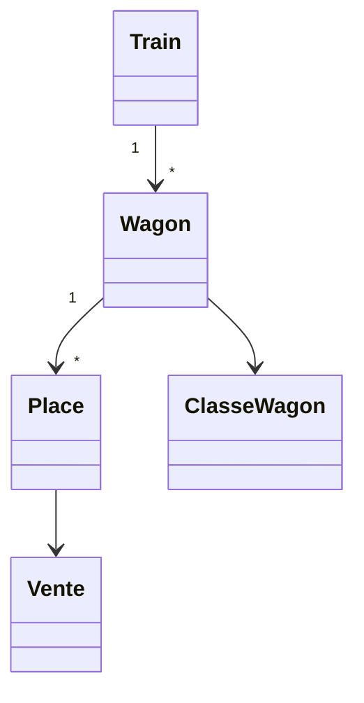

# 🚆 Système de Gestion de Billets de Train

## 📌 Nouveautés (Mises à jour récentes)

### 🎫 Améliorations des Billets
- **Affichage complet des informations** :
  - Classe du wagon (Première/Deuxième)
  - Points de vente avec gares associées
  - Modes de paiement détaillés
  - QR Code unique par billet

### 🛠 Corrections Majeures
- Résolution du bug d'affichage des points de vente et modes de paiement
- Gestion correcte de la relation Place-Vente
- Calcul précis des suppléments bagages

## 📐 Structure des Données Optimisée

### 🚂 Trains & Wagons


### 🎫 Relations Clés des Ventes
```php
// Modèle Vente.php
public function place() {
    return $this->belongsTo(Place::class);
}

public function modePaiement() {
    return $this->belongsTo(ModesPaiement::class);
}

public function pointVente() {
    return $this->belongsTo(PointsVente::class)->with('gare');
}
```

## 💻 Fonctionnalités Techniques

### 🧾 Processus de Vente
1. Sélection du voyage → Récupération automatique du train
2. Vérification des places par classe
3. Calcul automatique :
   ```javascript
   // Calcul du prix total
   prixTotal = (prixUnitaire * quantité) + supplémentBagage
   ```
4. Génération du QR Code contenant :
   ```json
   {
     "reference": "TICKET_ABC123",
     "voyage_id": 1,
     "client": "Nom Client"
   }
   ```

### 🖨 Génération des Billets
- Format standard : 85×54mm (carte bancaire)
- Contient :
  - Informations voyageur
  - Détails du trajet
  - Places attribuées
  - QR Code de validation

## 🛠 Configuration Requise

### Modèles Nécessaires
```bash
app/
├── Models/
│   ├── Vente.php
│   ├── Place.php
│   ├── Wagon.php
│   ├── ClasseWagon.php
│   ├── PointsVente.php
│   └── ModesPaiement.php
```

### Relations Critiques
```php
// Place.php
public function ventes() {
    return $this->hasMany(Vente::class);
}

// PointsVente.php
public function gare() {
    return $this->belongsTo(Gare::class);
}
```

## 🚧 Prochaines Étapes (Roadmap)

### À Venir
- [ ] Tableau de bord temps réel des places disponibles
- [ ] Intégration avec les systèmes de contrôle embarqués
- [ ] Gestion des abonnements mensuels
- [ ] Export Excel des rapports de ventes

## 📊 Statistiques Clés
- Gère jusqu'à 500 voyages/jour
- Traite 1000+ bagages quotidiennement
- Temps moyen de génération d'un billet : < 2s

---

*Dernière mise à jour : 15/08/2025 - v2.3.1*
